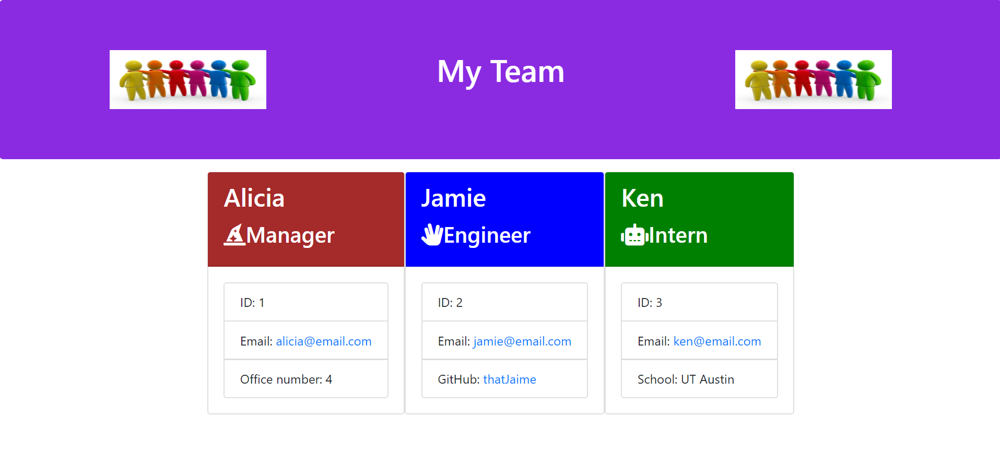

# Homework 10

# Template Engine - Employee Summary

## User Story

```
As a manager
I want to generate a webpage that displays my team's basic info
so that I have quick access to emails and GitHub profiles
```
## Description

This application is a node command line application to allow a user to generate a page that displays the pertinent information of members of a software engineering team.  After downloading the source code and running the application with node.js, the user will be prompted to enter the information of all the team members.  That information is then used to create an html file that can be displayed in the browser for easy reference.

## Completed

```
* Each employee generated using classes/subclasses
* Classes validated with test suites
* Used npm packages to run test suites and user question prompts
```

## Application URL

https://robynp108.github.io/10TeamProfileGenerator/

## Application Screenshot


